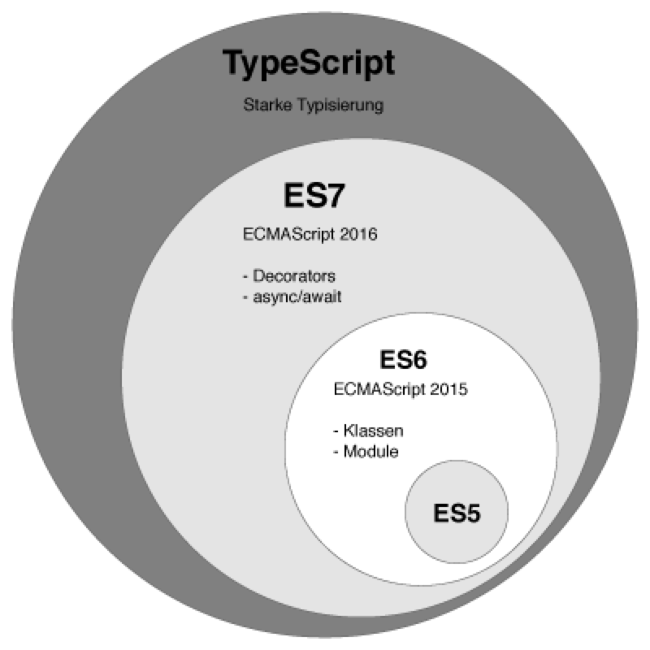

# 一、Typscript是什么
TypeScript = Type + Script（标准JS）。我们从TS的官方网站上就能看到定义：TypeScript is a typed superset of JavaScript that compiles to plain JavaScript。TypeScript是一个编译到纯JS的有类型定义的JS超集。

<div style="margin-bottom:10px;text-align:center;background-color:#fff;">
    
</div>

# 二、为什么要用Typescript
**从开发效率上看，** 虽然需要多写一些类型定义代码，但TS在VSCode、WebStorm等IDE下可以做到智能提示，智能感知bug，同时我们项目常用的一些第三方类库框架都有TS类型声明，我们也可以给那些没有TS类型声明的稳定模块写声明文件，这在团队协作项目中可以提升整体的开发效率。

**从可维护性上看，** 长期迭代维护的项目开发和维护的成员会有很多，团队成员水平会有差异，而软件具有熵的特质，长期迭代维护的项目总会遇到可维护性逐渐降低的问题，有了强类型约束和静态检查，以及智能IDE的帮助下，可以降低软件腐化的速度，提升可维护性，且在重构时，强类型和静态类型检查会帮上大忙，甚至有了类型定义，会不经意间增加重构的频率（更安全、放心）。

**从线上运行时质量上看，** 我们现在的SPA项目的很多bug都是由于一些调用方和被调用方（如组件模块间的协作、接口或函数的调用）的数据格式不匹配引起的，由于TS有编译期的静态检查，让我们的bug尽可能消灭在编译器，加上IDE有智能纠错，编码时就能提前感知bug的存在，我们的线上运行时质量会更为稳定可控。

<u>*Demo: eslint、tsEslint* </u>


# 三、Typescript环境搭建

1.初始化 npm 包管理(如果没 npm 命令则需安装node)

`npm init`

2.安装依赖(本地安装)

`npm install ts-node typescript nodemon -D`

3.初始化 TypeScript 配置文件

`node_modules/.bin/tsc --init`

```
"scripts": {
   ...
   "tsc": "tsc"
}
npm run tsc -- --init
```

<u>*Demo: tsInit* </u>

# 四、tsconfig.json

```
{
    "compilerOptions": {
        "incremental": true, // TS编译器在第一次编译之后会生成一个存储编译信息的文件，第二次编译会在第一次的基础上进行增量编译，可以提高编译的速度
        "tsBuildInfoFile": "./buildFile", // 增量编译文件的存储位置
        "diagnostics": true, // 打印诊断信息 
        "target": "ES5", // 目标语言的版本['ES3' (default), 'ES5', 'ES2015', 'ES2016', 'ES2017', 'ES2018', 'ES2019', 'ES2020', 'ES2021', or 'ESNEXT']
        "module": "CommonJS", // 生成代码的模板标准['none', 'commonjs', 'amd', 'system', 'umd', 'es2015', 'es2020', or 'ESNext']
        "outFile": "./app.js", // 将多个相互依赖的文件生成一个文件，可以用在AMD模块中，即开启时应设置"module": "AMD",
        "lib": ["DOM", "ES2015", "ScriptHost", "ES2019.Array"], // TS需要引用的库，即声明文件，es5 默认引用dom、es5、scripthost,如需要使用es的高级版本特性，通常都需要配置，如es8的数组新特性需要引入"ES2019.Array",
        "allowJS": true, // 允许编译器编译JS，JSX文件
        "checkJs": true, // 允许在JS文件中报错，通常与allowJS一起使用
        "outDir": "./dist", // 指定输出目录
        "rootDir": "./", // 指定输出文件目录(用于输出)，用于控制输出目录结构
        "declaration": true, // 生成声明文件，开启后会自动生成声明文件
        "declarationDir": "./file", // 指定生成声明文件存放目录
        "emitDeclarationOnly": true, // 只生成声明文件，而不会生成js文件
        "sourceMap": true, // 生成目标文件的sourceMap文件
        "inlineSourceMap": true, // 生成目标文件的inline SourceMap，inline SourceMap会包含在生成的js文件中
        "declarationMap": true, // 为声明文件生成sourceMap
        "typeRoots": [], // 声明文件目录，默认时node_modules/@types
        "types": [], // 加载的声明文件包
        "removeComments":true, // 删除注释 
        "noEmit": true, // 不输出文件,即编译后不会生成任何js文件
        "noEmitOnError": true, // 发送错误时不输出任何文件
        "noEmitHelpers": true, // 不生成helper函数，减小体积，需要额外安装，常配合importHelpers一起使用
        "importHelpers": true, // 通过tslib引入helper函数，文件必须是模块
        "downlevelIteration": true, // 降级遍历器实现，如果目标源是es3/5，那么遍历器会有降级的实现
        "strict": true, // 开启所有严格的类型检查
        "alwaysStrict": true, // 在代码中注入'use strict'
        "noImplicitAny": true, // 不允许隐式的any类型
        "strictNullChecks": true, // 不允许把null、undefined赋值给其他类型的变量
        "strictFunctionTypes": true, // 不允许函数参数双向协变
        "strictPropertyInitialization": true, // 类的实例属性必须初始化
        "strictBindCallApply": true, // 严格的bind/call/apply检查
        "noImplicitThis": true, // 不允许this有隐式的any类型
        "noUnusedLocals": true, // 检查只声明、未使用的局部变量(只提示不报错)
        "noUnusedParameters": true, // 检查未使用的函数参数(只提示不报错)
        "noFallthroughCasesInSwitch": true, // 防止switch语句贯穿(即如果没有break语句后面不会执行)
        "noImplicitReturns": true, //每个分支都会有返回值
        "esModuleInterop": true, // 允许export=导出，由import from 导入
        "allowUmdGlobalAccess": true, // 允许在模块中全局变量的方式访问umd模块
        "moduleResolution": "node", // 模块解析策略，ts默认用node的解析策略，即相对的方式导入
        "baseUrl": "./", // 解析非相对模块的基地址，默认是当前目录
        "paths": { // 路径映射，相对于baseUrl
            // 如使用jq时不想使用默认版本，而需要手动指定版本，可进行如下配置
            "jquery": ["node_modules/jquery/dist/jquery.min.js"]
        },
        "rootDirs": ["src","out"], // 将多个目录放在一个虚拟目录下，用于运行时，即编译后引入文件的位置可能发生变化，这也设置可以虚拟src和out在同一个目录下，不用再去改变路径也不会报错
        "listEmittedFiles": true, // 打印输出文件
        "listFiles": true// 打印编译的文件(包括引用的声明文件)
    },
    "files": [
        "scr/a.ts"  // 指定编译文件是src目录下的a.ts文件
    ],
    "include": [
        "scr" // 会编译src目录下的所有文件，包括子目录
        "scr/*" // 只会编译scr一级目录下的文件
        "scr/*/*" // 只会编译scr二级目录下的文件
    ],
    "exclude": [
        "src/lib" // 排除src目录下的lib文件夹下的文件不会编译
    ],
    "extends": "./tsconfig.base.json" // 把基础配置抽离成tsconfig.base.json文件，然后引入
}
```
<u>*Demo: tsInit* </u>

# 五、Typescript声明文件

（https://ts.xcatliu.com/basics/declaration-files.html#san-xie-xian-zhi-ling）

* declare var 声明全局变量
* declare function 声明全局方法
* declare class 声明全局类
* declare enum 声明全局枚举类型
* declare namespace 声明（含有子属性的）全局对象
* interface 和 type 声明全局类型
* export 导出变量
* export namespace 导出（含有子属性的）对象
* export default ES6 默认导出
* export = commonjs 导出模块
* export as namespace UMD 库声明全局变量
* declare global 扩展全局变量
* declare module 扩展模块
* /// <reference /> 三斜线指令

<u>*Demo: tsDoc* </u>

# 六、Typescript文档学习

1、Typescript中的数据类型
* 布尔类型（boolean）
* 数字类型（number）
* 字符串类型（string）
* 数组类型（array）
* 元组类型（tuple）
* 枚举类型（enum）
* 任意类型（any）
* null和undefined
* void类型
* never类型
  
<u>*Demo: tsDoc/src/index.ts* </u>

2、函数

<u>*Demo: tsDoc/src/fn.ts* </u>

3、类

<u>*Demo: tsDoc/src/class.ts* </u>

4、接口（interface）

<u>*Demo: tsDoc/src/class.ts* </u>

5、泛型（泛型函数、泛型类、泛型接口）

<u>*Demo: tsDoc/src/T.ts* </u>

6、命名空间（namespace）

<u>*Demo: tsDoc/src/nameSpace.ts* </u>

7、装饰器

<u>*Demo: tsDoc/src/decorator.ts* </u>
